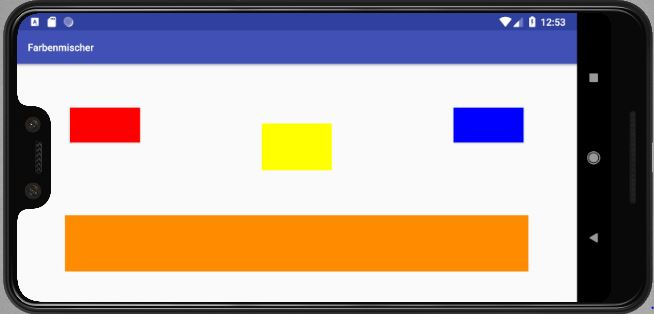

# Farbenmischer
> Kids can create colors with primary colors. Kids get a voice feedback of the names of each color in German language and a visual feedback on the screen.

Let your kid mark two basic colors on the touchscreen and her or him will be given back the resulting color on the screen and the color will also be spoken.




## Execute

Android:

```csharp
Install Farbenmischer.apk
```

or

```java
Android Studio: Build APK
```


## **Technologies**

Created with

- [ ] Android Studio 3.4
- [ ] Typora

Programming language:

- [ ] Java

Application style:

- [ ] Android App

  

## Release History

* 1.3
  
    * CHANGE: translated code elements like variables from German to English
    
* 1.2
  
    * FIX: Bug in recalling a method
    
* 1.1
  
    * UPDATE: implemented voice output
    
* 1.0
  
    * Work in progress
    
      

## Meta

Marcus Greiner – marcusGreiner@ITsmus.de

[https://github.com/velotist/Farbenmischer](https://github.com/dbader/)

